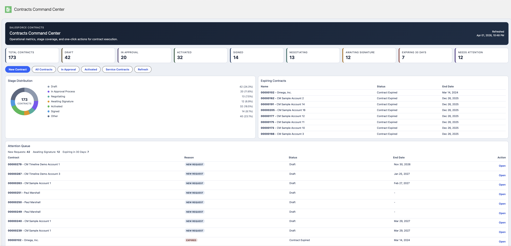
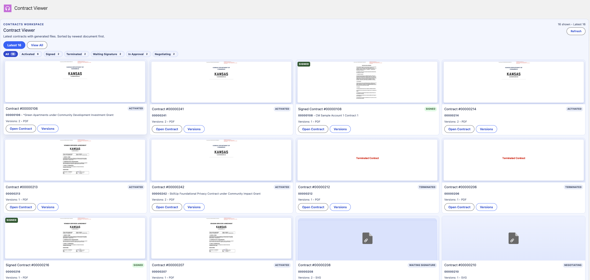
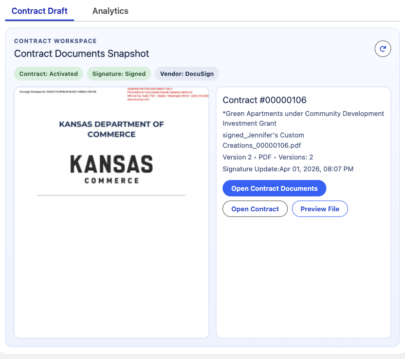
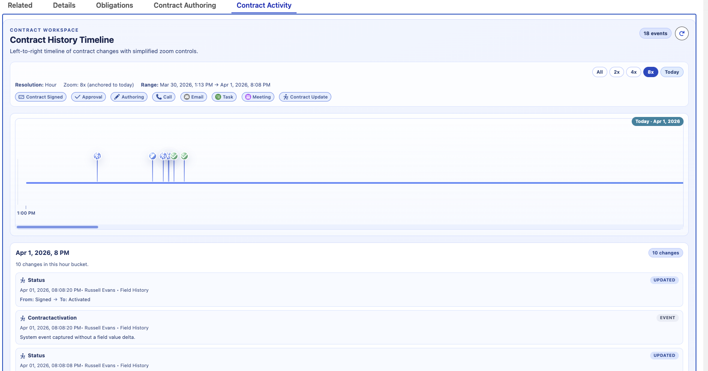
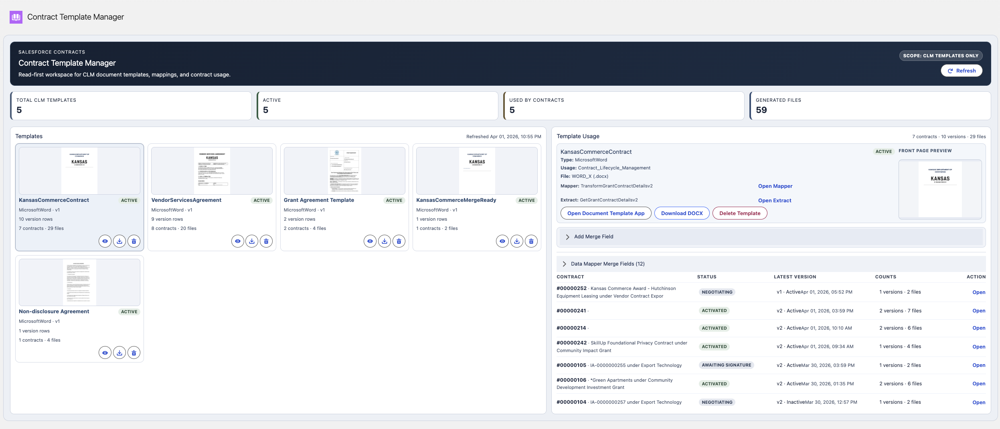
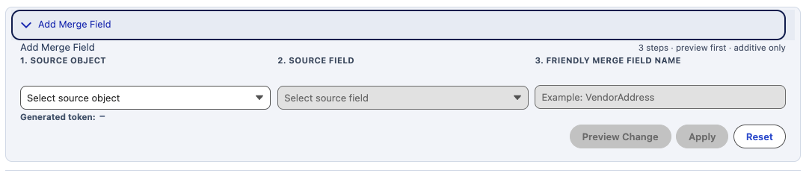
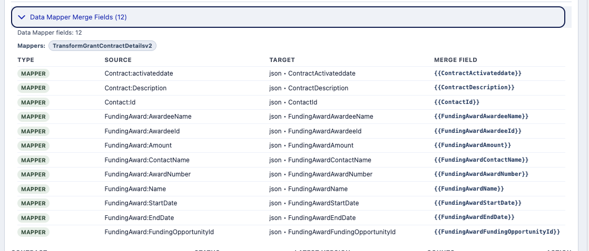

# Salesforce Contracts Management Toolset

Custom Salesforce contracts accelerator with command center, viewer, timeline, and template manager.

## Easy Deploy
<a href="https://githubsfdeploy.herokuapp.com?owner=thedges&repo=PS2MapComponents&ref=main">
  
</a>

## Included Features

### Contracts Command Center (`c:contractsCommandCenter`)
- Top KPI strip for lifecycle and attention metrics.
- Stage Distribution donut chart.
- Expiring Contracts panel.
- Attention Queue with quick-open actions.
- Quick actions: New Contract, list views, refresh.
- Why teams use it: gives executives and reviewers an immediate health check of contract operations without opening reports.
- Why teams use it: surfaces high-risk and time-sensitive contracts fast, reducing missed renewals and stalled approvals.


### Contract Viewer (`c:contractsDocumentViewer`)
- Contract document thumbnail grid (multi-record view).
- Signed/status indicators on cards.
- Contract open links and version visibility.
- Refresh support for newly generated files/thumbnails.
- Why teams use it: lets legal and program staff visually validate the right contract files without drilling into each record.
- Why teams use it: speeds review prep by showing signed/active document context in one screen.


### Contract Documents Snapshot on Contract Page (`c:contractRecordDocumentsPanel`)
- Snapshot card on the Contract record to show the latest generated/signed contract document.
- Includes status pills, quick contract/document actions, and embedded thumbnail preview.
- Why teams use it: gives record-level confidence that the latest contract version and signature state are correct.
- Why teams use it: reduces clicks for contract owners by keeping the key document actions on the contract itself.


### Contract History Timeline (`c:contractHistoryTimeline`)
- Left-to-right contract event timeline.
- Zoomed time navigation for dense contract activity.
- Combined events: field history, approvals, tasks/calls/emails/events.
- Interactive filtering and synchronized details panel.
- Why teams use it: creates a clear audit narrative of who changed what and when across the full contract lifecycle.
- Why teams use it: helps investigators and reviewers isolate delays or bottlenecks at hour/minute granularity.


### Contract Template Manager (`c:contractsTemplateManager`)
- Template catalog grid with preview thumbnails.
- Template usage metrics and contract drilldown.
- Open Mapper/Extract in OmniStudio builder.
- Download template DOCX.
- Optional template delete action.
- Why teams use it: centralizes template governance so admins can quickly identify active, stale, and heavily used templates.
- Why teams use it: shortens template maintenance cycles with direct access to files, transforms, and usage evidence.


### Merge Field Authoring (inside Template Manager)
- Accordion-based Add Merge Field workflow.
- 3-step guided builder (Object -> Field -> Friendly Name).
- Suggested merge token generation.
- Preview-before-apply validation.
- Additive mapper/extract write behavior.
- Why teams use it: enables non-developers to safely extend document merge fields without manually editing DataRaptors.
- Why teams use it: reduces deployment dependency for common template enhancements, accelerating business iteration.



### Agentforce Contract Summary Action (`Contract_Obligations_Summary_For_Agentforce`)
- Autolaunched flow that compiles obligation status for a selected Contract.
- Calls Prompt Template `Contracts_Summary` from Flow and returns AI output.
- Output variables include `agentResponse` (primary) and `obligationsSummary` (debug/supporting context).
- Why teams use it: gives reviewers an instant, AI-written contract risk summary without manually scanning obligation records.
- Why teams use it: standardizes contract-review narratives for agents and staff with consistent overdue/risk context.

## App Pages / Tabs
- `SalesforceContracts_Command_Center`
- `SalesforceContracts_Viewer`
- `SalesforceContracts_Template_Manager`
- `SalesforceContracts_Analytics`

## Deploy Custom UI
```bash
./scripts/deploy-command-center.sh --alias cm-prod-demo
```

## Target Org Safety Check
```bash
./scripts/preflight-target.sh --alias cm-prod-demo
```

## Primary Custom Assets

### LWCs
- `contractsCommandCenter`
- `contractsDocumentViewer`
- `contractRecordDocumentsPanel`
- `contractHistoryTimeline`
- `contractsTemplateManager`

### Apex Controllers
- `SDO_ContractsCommandCenterController`
- `SDO_ContractViewerController`
- `SDO_ContractHistoryTimelineController`
- `SDO_ContractTemplateManagerController`
- `SDO_ContractPromptTemplateInvocable`

## Agentforce / Prompt Assets
- `Contract_Obligations_Summary_For_Agentforce` (Autolaunched Flow)
- `Contracts_Summary` (GenAI Prompt Template)

## Developer Change Log
- See [docs/developer-change-log.md](docs/developer-change-log.md)
